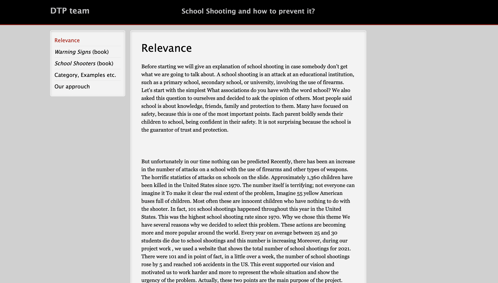
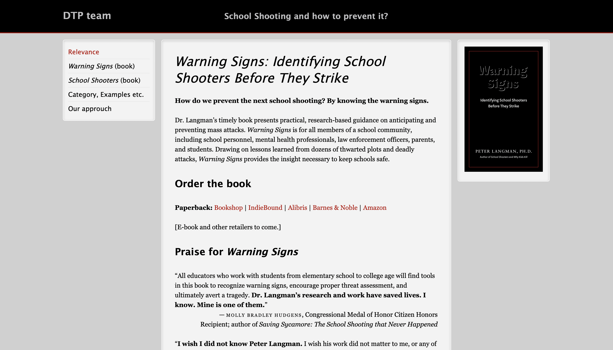
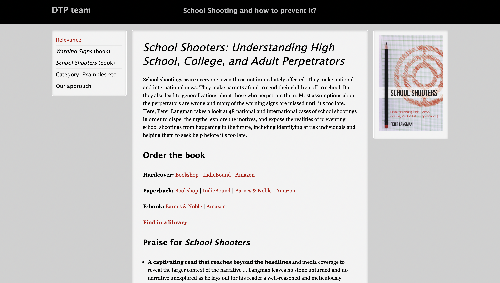
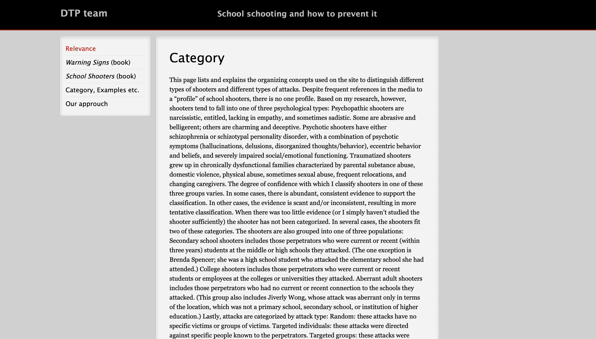
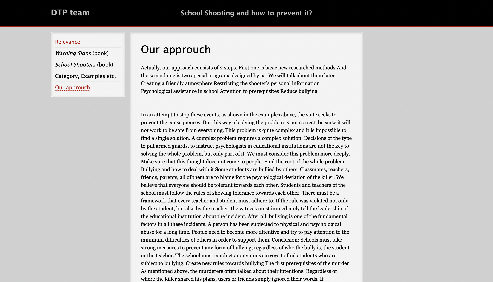

# Schoolshooting Website
## Project Description

This project was created to test the knowledge of Frontend website design. Developed as part of a scientific initiative, it addresses the issue of school shootings and their prevention. The website was built using HTML and CSS, showcasing key solutions and preventive measures. It was presented at four international project competitions, earning two silver and two bronze awards.
 
## Features
The website features five primary sections:
+ Relevance: A detailed section providing insights into the urgency and significance of the issue of school shootings, backed by statistics and research findings.
+ Warning Signs: A section dedicated to book related to school shootings. "Warning Signs" by Dr. Langman, offering practical, research-based guidance on preventing school violence. For those interested in the book, the website provides links to search for it in libraries or purchase it online.
+ School Shooters: "School Shooters: Understanding High School, College, and Adult Perpetrators" by Dr. Peter Langman, which analyzes real cases to dispel myths, explore motives, and provide actionable insights for preventing future incidents. For those interested in the book, the website provides links to search for it in libraries or purchase it online.
+ Categories: Explains the different psychological profiles and types of school shooters, based on research. It categorizes them into psychopathic, traumatized, and other types, helping users understand the complexity and patterns behind such actions.
+ Our Approach: Discusses a two-step strategy to address school shootings, involving new research-based methods and programs designed to foster a safe and supportive school environment. Emphasizes reducing bullying, improving psychological support, and creating a culture of empathy and respect within schools.

## Instalation
### Prerequisites
Before setting up the project, ensure you have the following installed:
+ Git: [Download Git](https://git-scm.com)
+ Web Browser: Any modern browser (e.g., Chrome, Firefox).

### Installation Steps
1) Clone the repository:
    ```bash
    git clone https://github.com/JustImash/website-school-shooting
2) Navigate to the project directory:
   ```bash
   cd website-school-shooting

3) open HTML files directly in the browser
   

## Usage
Once the website is launched, users can explore its primary sections to gather detailed and relevant information.
Explore the Relevance page to gain insight into the importance of addressing school shootings through key statistics and analysis. The Literature sections provide access to books and research offering practical guidance. Visit Categories to understand psychological profiles and patterns associated with perpetrators. Lastly, the Our Approach section highlights a two-step method for creating a safe school environment by reducing bullying and enhancing psychological support.

## Screenshots

Relevance:


"Warning Signs" page:


"School Shooters" page:


Category page:


Our approach page:


## Technologies Used
+ Frontend: HTML, CSS

+ Other Tools: Git

## Roadmap

- [ ] Establishment of a dedicated hotline to support individuals experiencing bullying, aimed at preventing schoolshooting incidents 

I will be glad for external support and contribution for my project.

## Contributing

Guidelines for contributing to the project:

1. Fork the repository.
2. Create a new branch:
   ```bash
   git checkout -b feature-name
3) Make your changes and commit them:
   ```bash
   git commit -m "Description of changes"
4) Push to your branch:
   ```bash 
   git push origin feature-name
5) Open a pull request.

## License

This project is licensed under the MIT License.

## Contacts
+ Imangali Zhapakov: Imanzhapaqov@gmail.com
+ Project Link: https://github.com/JustImash/website-school-shooting
## Acknowledgments

Peter Langman: "Warning Signs: Identifying School Shooters Before They Strike" 

Peter Langman: "School Shooters: Understanding High School, College, and Adult Perpetrators"

Special thanks to all contributors and supporters of this project.